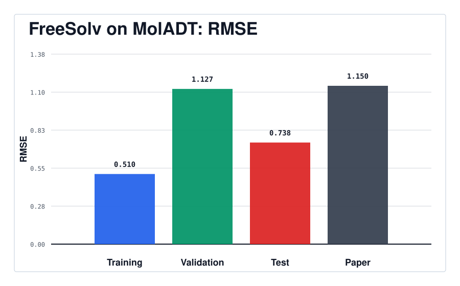
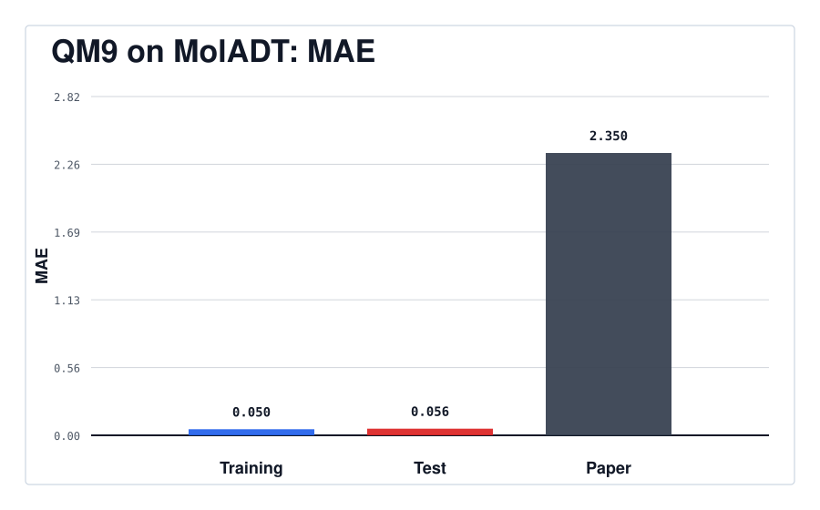
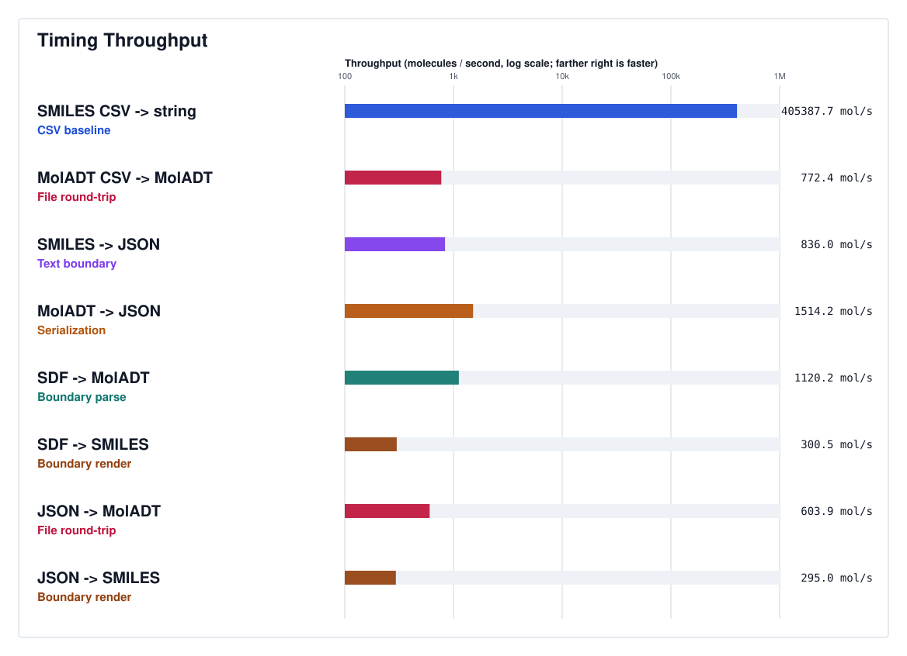

# Results

Generated benchmark and timing outputs are written here during local runs.

The directory is tracked so it appears on GitHub. Most run artifacts stay ignored because they are large and machine-specific, but compact summary outputs such as paper-facing SVGs and small CSV summaries can be checked in when needed.

For the commands that produce these files, start with the root [README](../README.md#benchmarking). For the file-by-file output contract, see [docs/outputs.md](../docs/outputs.md). For benchmark split details and comparison context, see [docs/inference-and-benchmarks.md](../docs/inference-and-benchmarks.md).

The full committed reference bundle is FreeSolv. QM9 and timing keep only their paper-facing SVG graphs and captions in Git; the heavier run details stay local.

Typical subdirectories include:

- [`freesolv/`](freesolv/): FreeSolv RMSE comparison runs from `make freesolv`
- [`qm9/`](qm9/): QM9 `mu` MAE comparison runs from `make qm9long`
- [`timing/`](timing/): timing comparison runs from `make timing`

## Checked-In Artifacts

### FreeSolv

Source command: `make freesolv`

Main generated files: `freesolv_rmse_vs_moleculenet.svg`, `caption.txt`, `freesolv_bayesian_model.txt`, `details/model_coefficients.csv`, `details/predictions.csv`, `details/freesolv_train_test_uncertainty.csv`, and raw Stan output under `details/stan_output/`.

The matching processed data needed to reproduce the fixed FreeSolv GP path is committed under `data/processed/freesolv_moladt_featurized_*`.

### QM9

Source command: `make qm9long`

Checked-in files: `qm9_mae_vs_moleculenet.svg` and `caption.txt`

### Timing

Source command: `make timing`

Checked-in files: `timing_overview.svg` and `caption.txt`

## Local-Only Details

QM9 and timing detail files are still produced locally by the normal commands, but they are ignored by Git:

- `make qm9long` writes `results/qm9/long/run_<timestamp>/`
- `make timing` writes `results/timing/paper/run_<timestamp>/`
